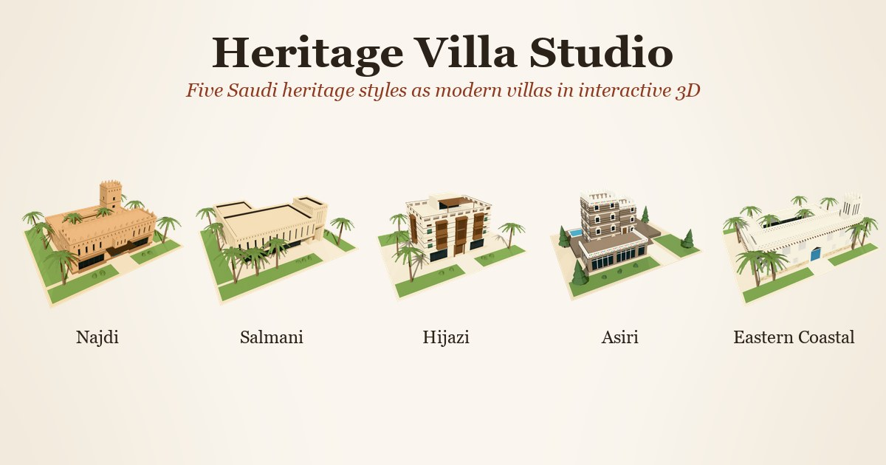

# Heritage Villa Studio

**Saudi heritage styles as modern villas.** An interactive 3D studio of the nineteen regional
architectural styles of the Saudi Architecture characterization, each built as a contemporary villa.
Turn each villa on its plinth, read the signature motifs pinned to its walls and roofline, and follow
it through its courtyard, plan, street and region.



---

## Contents

- [What it is](#what-it-is)
- [The styles](#the-styles)
- [How it was made](#how-it-was-made)
- [Running it](#running-it)
- [How it is put together](#how-it-is-put-together)
- [Notes on the 3D viewer](#notes-on-the-3d-viewer)
- [Accessibility](#accessibility)
- [Deployment](#deployment)

---

## What it is

Nineteen modern villas, one per heritage style, each modelled in 3D with the motifs that identify the
style. The viewer is the centre of the app: a turntable stage where a villa can be orbited, zoomed,
sectioned and read.

|                           |                                                                                                        |
| ------------------------- | ------------------------------------------------------------------------------------------------------ |
| **Turn the villa**        | Orbit, pan and zoom the model, or drive it from the keyboard (arrows, `+`/`-`, `Home`)                 |
| **Read its motifs**       | Five hotspot pins per villa, fixed to the geometry; hover one for its annotation, click to push in     |
| **See through it**        | Wireframe and x-ray section layers, plus a turntable reference grid                                    |
| **Go deeper**             | Courtyard view, a true plan section, signature motifs, the street approach and the style's region      |
| **Learn and test**        | A written lesson per style, a timeline, and a quiz                                                     |
| **Search everything**     | `⌘K` finds styles, villas, motifs and rooms                                                            |

The whole app is bilingual (English / Arabic, with RTL layout).

---

## The styles

Ordered as the library lists them, roughly north to south and inland to coast.

| Style            | Region             | Signature motifs                                              | How the villa reads                                                              |
| ---------------- | ------------------ | ------------------------------------------------------------- | -------------------------------------------------------------------------------- |
| Najdi            | Najd               | Furjat, shurfat, tarma                                        | Courtyard villa in earthen render, dark-backed triangle band, corner burj         |
| Salmani          | Najd (Riyadh)      | Deep shadow lines, modular facade, triangle crown             | Stone volume cantilevered over glass, deep slot windows, entry portal, pool court |
| Qassimi          | Al-Qassim          | Mud-brick coursing, carved doors, palm-trunk lintels          | Low earth-toned courtyard mass with a shaded loggia onto the date garden          |
| Ha'ili           | Ha'il              | Painted door panels, stepped merlons, narrow slit windows     | Compact fort-like block, battlemented parapet, colour at the openings             |
| Jouf             | Al-Jouf            | Dry-laid stone, olive-wood screens, sunken court              | Banded stone villa around a planted sunken court                                  |
| Northern Borders | Northern Borders   | Tent-line profiles, stone plinths, windbreak walls            | Long low stone base under a taut tented canopy                                    |
| Tabuki           | Tabuk              | Rock-cut arches, light sandstone, deep reveals                | Sandstone mass carved with arched recesses                                        |
| Madani           | Madinah            | Black basalt banded in white, timber screens, pointed arch    | Basalt bands, white plaster lifts, a white merlon crown over a stair tower        |
| Ulai             | Al-Ula             | Terraced mud-brick, framed viewing slots, oasis terraces      | Stepped terraces climbing the site, framed openings onto the palm oasis           |
| Hijazi           | Hijaz              | Roshan / mashrabiya lattice, coral coursing, high vents       | Three-storey coral-stone block with stacked rawashin and a latticed roof terrace  |
| Taifi            | Taif               | Rose-granite masonry, timber balconies, pergolas              | Granite villa with deep timber balconies over a rose terrace                      |
| Bahi             | Al-Baha            | Slate string courses, stone towers, juniper timber            | Stone tower villa with projecting slate drip courses                              |
| Asiri            | Asir               | Al-Qatt Al-Asiri painting, slate courses, qamariyat           | Tapering stone towers on a terrace, ribbed walls, painted friezes, glazed wing    |
| Tihami           | Tihama             | Conical thatch forms, reed screens, painted interiors         | Masonry base beside thatched round pavilions                                      |
| Jazani           | Jazan              | Oshah roundhouse, mud rings, tall thatch cone                 | Modern block anchored by a full-height oshah drum                                 |
| Farasani         | Farasan Islands    | Carved gypsum rosettes, coral blocks, shaded arcades          | Coral-block villa with gypsum rosette panels and a sea-facing arcade              |
| Najrani          | Najran             | Mud tower house, projecting rain drips, rammed-earth courses  | Tall rammed-earth tower with shaded courses over a low wing                       |
| Eastern Coastal  | Eastern Province   | Coral & gypsum, carved screens, danchal, riwaq, badgir        | Gypsum courtyard house on a coral base, pointed arcade, two-tone Qatif court      |
| Ahsai            | Al-Ahsa            | Palm-trunk danchal, gypsum relief, shaded oasis courts        | Oasis courtyard villa with exposed danchal beams under palm shade                 |

Adding a twentieth style means adding a data file in [`src/data/styles/`](src/data/styles), a model and
its images. The viewer and the UI are data-driven. [`src/types/empire.ts`](src/types/empire.ts) is the
contract (it keeps its name from the app's first life as an empire atlas).

---

## How it was made

### The models — Blender, procedurally

Each villa is generated by a Python script run in Blender 5.2 through the 3D Jutsu Blender MCP:

- [`scripts/blender/villa_lib.py`](scripts/blender/villa_lib.py) is a small kit: walls with real
  openings, glazing, furjat bands, shurfat, rawashin, lattice, ribs, arcades, thatch drums, stone
  skins, palms, pools, a plan-section cutter and the render helpers.
- One script per style in [`scripts/blender/`](scripts/blender) — nineteen of them, from
  [`najdi.py`](scripts/blender/najdi.py) to [`ahsai.py`](scripts/blender/ahsai.py) — builds the villa,
  declares its hotspot anchors in metres, and lists its camera shots.

Every villa is built on the same 34 × 28 m site, and the kit clamps planting to that footprint so the
models frame identically on the stage.

Geometry is merged into one mesh per material, so every mesh in the exported GLB carries a single
flat PBR material (`public/models/*.glb`, 0.3–1.5 MB each, no textures). The build prints the hotspot
anchors already converted to the viewer's normalised box space. The Blender exports include a sun
rig and a camera; the viewer drops both on load.

### The imagery — rendered from the same models

Every image in `public/img/<style>/` comes from the model it describes, rendered in Eevee — 133 images
in all, six per villa plus a region map:

| Card            | Shot                                                                      |
| --------------- | ------------------------------------------------------------------------- |
| Hero, thumbnail | Three-quarter aerial views                                                |
| Courtyard view  | Eye-level in the court, terrace or garden                                 |
| Floor plan      | The model sliced at roughly 2.4 m, caps filled dark, top ortho            |
| Signature motifs| A close-up of the facade's motifs                                         |
| Living here     | Eye-level street approach                                                 |

[`scripts/compose_images.py`](scripts/compose_images.py) lays the transparent renders onto the app's
paper tone and writes WebP. The region maps are drawn by [`scripts/make_maps.py`](scripts/make_maps.py)
from a simplified outline of Saudi Arabia (schematic, not for navigation).

---

## Running it

Requires Node 20 or newer (CI builds on 24).

```bash
npm install
npm run dev        # dev server on http://localhost:5173/dream3d/
npm run build      # typecheck, then production build to dist/
npm run preview    # serve the production build, as deployed
npm run lint
npm run verify     # the corpus and catalog-spec checks in scripts/studio/
```

`npm run build` runs `tsc --noEmit` first, so a type error fails the build rather than shipping.

The dev server runs under `/dream3d/` rather than `/`, because that is the path the site is served
from on GitHub Pages. Keeping development on the same prefix means a path that works locally works
deployed. See [Deployment](#deployment).

---

## How it is put together

```
index.html                   the single HTML entry; canonical og:/twitter: tags live here
vite.config.ts               base path, the `@` alias, chunking, the Pages 404/.nojekyll fallback
src/
├─ main.tsx                entry point: mounts <App> inside React's StrictMode
├─ App.tsx                 every route, on React Router, each lazily loaded in its own chunk
├─ three/
│  ├─ engine.ts            the entire 3D viewer — renderer, lighting, camera, transitions,
│  │                       hotspot resolution, model residency
│  └─ parametric/          the browser twin of the Blender kit: kit.ts builds geometry,
│                          build.ts assembles a villa from a spec
├─ components/
│  ├─ EmpireAtlasApp.tsx   app shell: layout, modal routing, responsive behaviour
│  ├─ Viewer.tsx           canvas host, tool rail, layer menu, request sequencing
│  ├─ HotspotLayer.tsx     screen-space pins and their hover annotations
│  ├─ EmpireLibrary.tsx    the style rail (desktop) and drawer contents (mobile)
│  ├─ InfoPanel.tsx        selected-villa detail, in a rail or in the page flow
│  ├─ BottomCards.tsx      the five exploration cards
│  ├─ Banner.tsx           dismissible attribution bar
│  ├─ modals.tsx           lesson, quiz, artefacts, timeline, sections, ⌘K search
│  ├─ corpus/              the reference pages' own components
│  ├─ studio/              the parametric studio's controls
│  └─ ui/                  shadcn/ui primitives
├─ routes/                 the non-exhibit pages: characters index, character, element,
│                          studio, and a real 404
├─ lib/
│  ├─ assets.ts            re-bases `public/` paths onto Vite's BASE_URL
│  ├─ utils.ts             the shadcn `cn` helper
│  └─ studio/              spec schema, parameters, framing, permalinks, cultural lint
├─ hooks/                  locale chrome, mobile breakpoint, scroll lock
├─ data/
│  ├─ index.ts             the ordered list of styles, re-based through asset()
│  ├─ styles/*.ts          one file per style: copy, facts, hotspots, lesson, quiz, timeline (EN + AR)
│  ├─ characters/          the architectural characters, with the registry invariants asserted
│  ├─ corpus/              cultural elements, palettes and sources, each carrying provenance
│  └─ catalog/             parametric villa specs
├─ i18n/translations.ts    the UI string table (EN + AR)
├─ index.css               Tailwind layers, plus the corpus and studio stylesheets
├─ styles/                 corpus.css, studio.css
└─ types/                  empire.ts (the exhibit contract), character.ts, element.ts,
                           provenance.ts, i18n.ts
scripts/
├─ blender/                procedural villa kit + one build script per style
├─ studio/                 the corpus and spec verification gates
├─ compose_images.py       renders → public/img/<style>/*.webp
└─ make_maps.py            schematic region maps
```

**Stack** — Vite 7 · React 19 · React Router 7 · TypeScript 5.9 · Tailwind CSS 3.4 · three.js 0.185
(WebGPU renderer with TSL node materials) · GSAP 3 · three-mesh-bvh · shadcn/ui

**Code splitting** — the viewer and the parametric kit are the bulk of the bundle, and three.js is
pinned to its own chunk, so a visitor who lands on a reference page never downloads either.

**Design language** — a warm parchment palette on Cormorant Garamond and Inter, defined once as CSS
custom properties in [`src/index.css`](src/index.css) and bridged into Tailwind and shadcn tokens.

**Responsive behaviour** — the three-column desktop stage engages at 1280px. Below that the style
library moves into a drawer behind a hamburger, the villa detail reads inline beneath the model,
and the exploration cards step from five columns to three, two, then one.

**On a phone** the viewer's tool rail leaves the left edge and docks along the bottom of the stage as
a single scrolling row — inside the thumb's arc, and no longer covering a third of the canvas. Modals
become sheets that hold the page still behind them. Layout decisions that depend on having room test
*both* dimensions rather than width alone, because a phone held in landscape is 844px wide and only
390px tall; the rail, the stage height and the orientation tip all switch on `min-height` as well as
`min-width`.

**iOS specifics** — the page is laid out edge to edge with `viewport-fit=cover`, and the insets are
given back through `env(safe-area-inset-*)`: whichever bar is topmost owns the notch, the last
section on the page clears the home indicator, and the horizontal inset is applied once on `body` so
a landscape notch never crops content. Heights are `dvh` rather than `vh`, so a collapsing URL bar
does not clip the stage. Text fields are at least 16px, below which Safari zooms the page on focus.

---

## Notes on the 3D viewer

A few decisions in [`src/three/engine.ts`](src/three/engine.ts) that are not obvious from the code:

**Hotspots resolve against the geometry, not against coordinates.** Authoring a pin as a fixed point
in the model's bounding box puts it in mid-air as often as on the building. Instead each hotspot
declares _what kind of surface_ it belongs on (`roof`, `court` or `wall`), and the engine samples a
20×20 top-surface height field over the footprint to find it, preferring candidates that are actually
visible from the resting camera. The authored anchor only breaks ties.

**The stage backdrop is CSS, not scene geometry.** The canvas is transparent. A rendered parchment
gradient would be run through ACES tone mapping and come out grey, so the backdrop is painted in CSS
behind the canvas and keeps the exact palette of the surrounding UI.

**Switching villas is a turntable spin.** The villa on stage spins up about its own axis and,
at the point where it is turning fastest, the next one takes over the same rotation and carries it to
rest. Nothing leaves the ground, which is what avoids the floor plane slicing through a colonnade or
an open courtyard, and lets the villa keep casting its shadow throughout.

**Shadows are drawn on demand.** Orbiting moves the camera, not the building, so the shadow map is
refreshed only when the geometry actually changes rather than every frame.

**Recently seen villas stay resident.** Six models are kept parsed in memory, and hovering a
style in the library begins fetching it, so the click that follows lands on a model that is already
downloaded, parsed, BVH-built and hotspot-resolved, instead of paying for all of that mid-animation.

**Pins cost nothing per frame.** The projection loop holds element handles by ref, takes the stage
size from a `ResizeObserver` rather than reading layout, reuses its vectors, and writes a class only
when it changes.

---

## Accessibility

- Full keyboard control of the viewer, and hotspot pins are focusable buttons whose annotation opens
  on focus as well as hover
- `prefers-reduced-motion` is honoured and tracked live: transitions resolve instantly, and the pin
  and loading animations stop
- Semantic landmarks, labelled controls, `aria-pressed`/`aria-expanded` on toggles, and live regions
  on loading state
- Focus rings are never removed, only restyled
- Touch targets meet the 44px guideline under `pointer: coarse`; small icon buttons grow their hit
  area with a pseudo-element rather than their visual size, so the design is unchanged on a desktop
- Controls that only appear on hover — the favourite hearts, the hotspot annotation — have tap
  equivalents, since a touchscreen has no hover state

---

## Deployment

The site is a fully static bundle — no server, no API routes — published to GitHub Pages by
[`.github/workflows/deploy.yml`](.github/workflows/deploy.yml) on every push to `main`. The workflow
installs from the lockfile with `npm ci`, builds, and uploads `dist/` through the official Pages
actions.

**One-time repository setup.** In *Settings → Pages*, set **Source** to **GitHub Actions**. Nothing
else is required: the workflow requests the `pages: write` and `id-token: write` permissions it needs,
and no secrets are involved — the build reads nothing from the environment.

Live at `https://osos3lom.github.io/dream3d/`.

### The subpath

A project site is served from `/<repo>/`, not from the domain root, so `base` in
[`vite.config.ts`](vite.config.ts) is `/dream3d/`. Two things follow from that:

- **Asset paths.** The dataset stores `public/` paths root-absolute (`/models/najdi.glb`). Those are
  re-based once, in [`src/data/index.ts`](src/data/index.ts), through
  [`asset()`](src/lib/assets.ts). Anything new that points at a file in `public/` at runtime has to
  go through the same helper — a bare `/img/...` string will 404 under the subpath.
- **Deep links.** GitHub Pages has no rewrite rules, so `/dream3d/ar` matches no file. The build
  writes a copy of `index.html` to `404.html`, which Pages serves for unmatched paths; the app boots
  from it and React Router renders the route the URL asks for. A `.nojekyll` file is emitted beside
  it so Pages serves the output verbatim.

**Renaming the repository, or using a custom domain,** means changing the base. It is read from
`VITE_BASE`, so no edit to the config is needed:

```bash
VITE_BASE=/my-other-repo/ npm run build   # a differently named project site
VITE_BASE=/ npm run build                 # a custom domain, or a user/org site
```

The canonical URLs in the `og:` and `twitter:` tags of [`index.html`](index.html) are absolute and
point at the GitHub Pages address; update them if the site moves.
